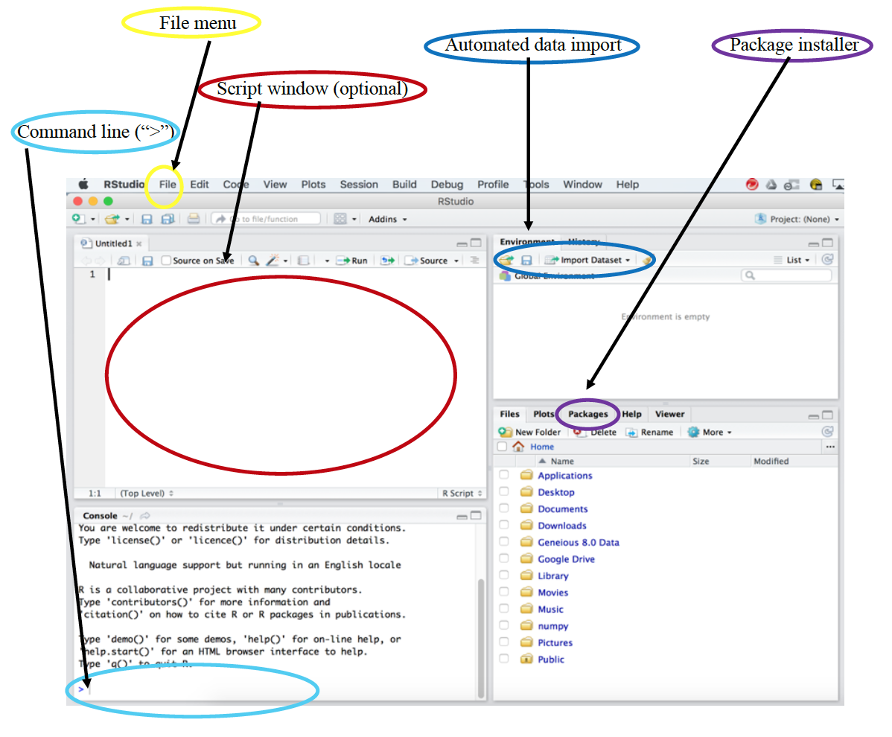

#RStudio Environment
Here we will gain some basic familiarity with the **RStudio** environment.  Usually the first confusion for students in using R is in actually installing it.  We typically encourage students to develop and interface with **R** through **RStudio**.  So let's take a look at what **RStudio** has to offer.  

Below is an image of the typical **RStudio** environment.


When R is opened, a workspace is created and code run from a script, at the command line or from one of the built in functions and by default is run from this workspace.


##Importing data

We will begin by importing a dataset posted by Merijn Coumans from a [Tesla User's Group](https://teslamotorsclub.com/tmc/threads/maxrange.35978/) about the battery life, charge history, location, etc. of Tesla cars.  A slightly cleaned version of the data can be found [cleanTeslaBattery.csv](Data/cleanTeslaBattery.csv).  Download this dataset and save it somewhere you can find it.

On the upper right select the *Import Dataset* button, for this case select *From Text (base)*.  When you find the dataset, select open and you will see a new menu open.  A few things to note are the "Name" box specifying the variable name assigned to the dataset, and also note the "Header" option and select appropriately depending on whether there is a header row or not.  Import the data.  Note what appears in the terminal.
```{r}
Tesla <- read.csv("Data/cleanTeslaBattery.csv")
View(Tesla)
```


**Teaching tip**: when first introducing this to students, it is helpful to identify how they can change the name of the file as they frequently download multiple copies of the same file and delete some (???), resulting in default or specified naming in labs not working.  Also, highlight the option for headers or not, as they commonly find ways to change this.

For entry level students, this is an easy way to import data, but it also provides us with an example of the command that we could have manually typed to load the data, and which we can put into our script or notebook document.  We will save this command for use in just a bit.

Without introducing object types or anything advanced, a quick summary of the data can give some useful information and let students know if the data read in as expected.  We will try that command shortly.


**Teaching tip** Students with Mac's using Numbers frequently open the files they download using Numbers.  Numbers adds some extra invisibles that will throw errors if the data is then loaded into R.


## Command line
Let's go ahead and compute a summary of the data we just imported to double-check how R is treating each variable, e.g. categorical, quantitative, or character.

```{r}
summary(Tesla)
```

Based on the summary, what can you say about how R is summarizing the *age* column?  This is good when working with introductory students.
  
   
**Questions**

1. The *head* and *tail* functions allow you to inspect the first few rows or last few rows in the data.  Implement one of these on your dataset.  How many rows of data do you get?

2. Try the *names* function on this data?  What does it produce?

To demonstrate the utility of R, let's compute the mean of the Mileage column.   
```{r}
mean(Tesla$MileageKM)
```


**Teaching tip**  this is a useful place to introduce students to case sensitivity and what happens when you forget a parentheses (You can get out of it using the *Esc* key.)


**Programmer's note**: R treats columns in a dataframe much like dictionaries in Python, as well as using matri notation like Python, Java or Matlab.  Aside from the "$" operator, one can reference the row or column using numbers or names (if they have them)  The code below computes the standard deviation of the same column.

```{r}
sd(Tesla[,"MileageKM"])
```

**Practice** Try the histogram function `hist` and the boxplot function `boxplot` on one of the quantitative variables.

**Teaching tip** When teaching R to introductory students, make it accessible as a go to tool for completing homework the first day.

**Teaching tip**  When importing data, frequently students will select the *readr* option.  In many cases this won't matter, but readr reads the data in as a tibble instead of a data frame. In many cases students won't notice, but because of data structure of the tibble object, there are cases where downstream analysis will not behave the same, so for simplicity the base option is often easier.  However, for more advanced users, tibble are often very helpful.

For intro students to make it their go to tool, they often need a calculator for their homework, show how it can be done easily.  Here we show how to input your own data and do some basic computations on it.
```{r}
dat <- c(1,9,23,35)
median(dat)
```
Note that the command `c()` specifies a list that is assigned to the variable `dat` that can then be used for calculation later.

**Teaching tip**  Intro. students often have a difficult time grasping that variable names are just a reference they are giving to something an that they can call that thing later on, so I often have them practice calling variables and renaming variables to help them overcome this.

## Scripts and Notebooks

This brings us to reproducability. One of the great strengths of R is in creating reproducible analyses. So let's save the code we just entered so that we can run it later.  First we will create a new R Script.

Under file, open a new R Script.  Copy the code you just entered at the terminal and past it into the script.  Note that you will have to delete the ">" character from each new line.  Some things to know about running from scripts:  The run button is the little green arrow  at the top of the text editor, if you select "run selected line(s)," the line the cursor is currently on will be run, or the current selected code will be executed.  Try re-running all of the code you have just entered in your script from the terminal.

Notebooks are another nice way to create reproducible analyses.  Under the file menu open a new notebook and you should see something like this:

You will find that the R community makes getting started in many of these files quite straightforward, with many detail on how to use them in the new files. Information on notebooks will be given later.

Note that the *cars* variable here is a pre-installed dataset that comes with R that is frequently used in examples.


**Teaching tip** Remind students to test what they have saved.  I find that often they may run something at the command line and forget to save it, so their code won't run from a clean workspace the next time.

***
**Question** When would students want to use the command line over a notebook or a script?

## Loading Packages

RStudio provides easy features for package management.  The lower right-hand window has a package manager.

The packages listed are currently installed, while others may be installed using the *Install* option.  Note that when you are ready to use a package you must also load it using the `library()` function.  Try loading the *ggplot2* package, which we will be using later in this workshop.

**Teaching Tip** Students often forget that the workspace and the variables in it use memory, so encourage them to clean up unused items in the workspace.  This is also a good reason to use a notebook, when a notebook is knit it is executed from an empty workspace.

