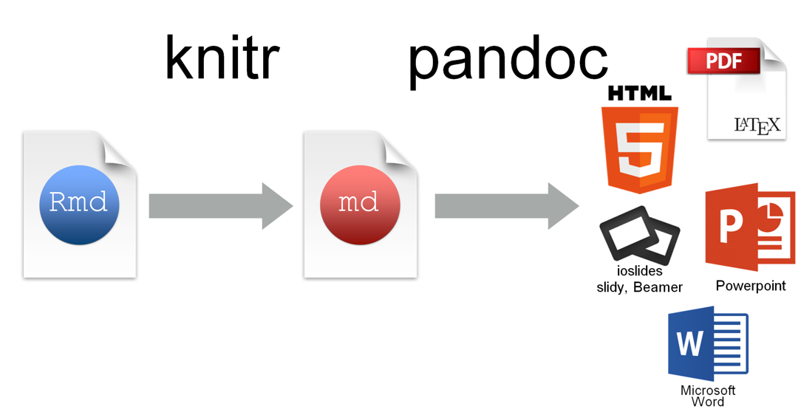
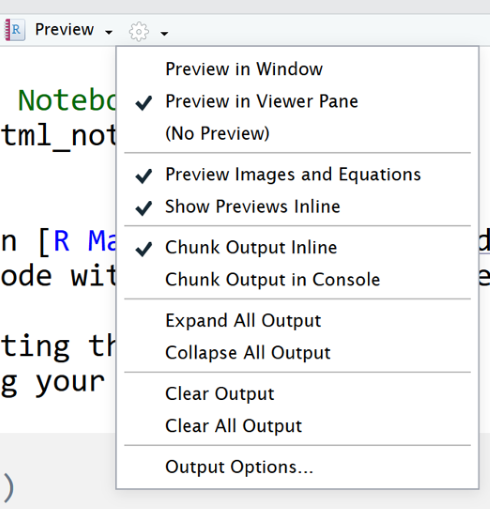

#RMarkdown and Reproducible Documentation

[Introduction to R.Rmd](PracticeNotebooks/JMMPractice_Introduction_to_Rmarkdown_Notebook.Rmd)  

## R, RStudio, and RMarkdown

One of the benefits of using R is that is comes with its own documentation system, called RMarkdown.  The distinction between R, RStudio, and RMarkdown is often blurred, but in there is a difference:  

- R is a programming language  
- RStudio is a writing software and GUI for using R    
- RMarkdown an authoring format for communication  

At the root of everything is the R programming language, but RStudio and RMarkdown layer on additional interfaces and languages to support reproducibility of results and communication.

To learn more, check out this short online resource [Getting Used to R, RStudio, and RMarkdown](https://ismayc.github.io/rbasics-book/).

## Communication with RMarkdown

The Markdown language has actually been around for a while.  It is a markup language with plain text formatting syntax that allows it to be converted to many output formats, such as HTML.  RMarkdown adapts the Markdown language and incorporates the ability to include R code and output (and other languages) seamlessly.  The beauty of R Markdown is that it allows you to create reproducible reports of analysis, without copy and pasting code/output, and to export those reports into HTML, Word .docx, and PDF.

Let's watch a short video to get a better overview.

[R Markdown Introduction](https://rmarkdown.rstudio.com/lesson-1.html)

Now let's create our first RMarkdown document! 

1. Start a new Project  
2. Download the following document and save it into your Project folder: [Introduction to R.Rmd](Practice Notebooks/JMMPractice-Introduction_to_Rmarkdown.Rmd)  
3. Check settings (gear) that is says “Preview in Viewer Pane”  
4. To see the output of the document, click Preview, What happened?   

## Learning More about R Markdown  

R Markdown can also be used to make presentations, tutorials, and data dashboards.  To learn more, check out [RMarkdown: The Definitive Guide](https://bookdown.org/yihui/rmarkdown/).  

You can also check out the [RMarkdown Cheatsheet](Documents/RMarkdown_Cheatsheet.pdf) and [RMarkdown Reference Guide](Documents/RMarkdown_Reference.pdf).

