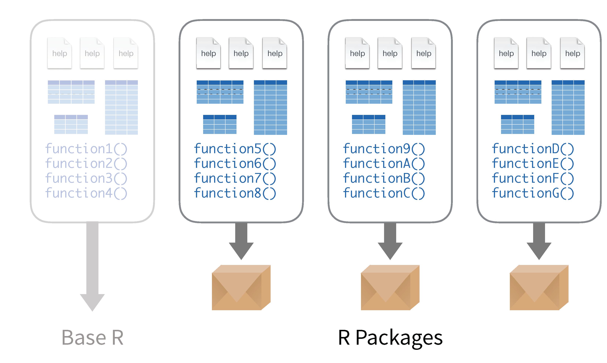
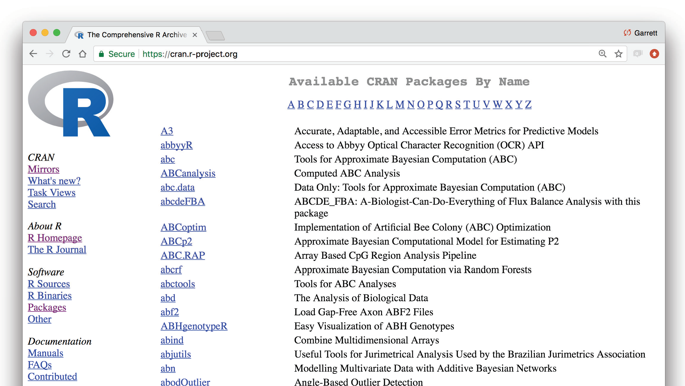
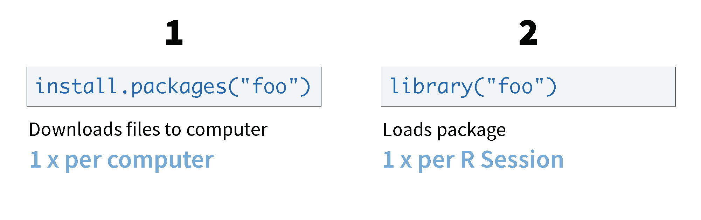
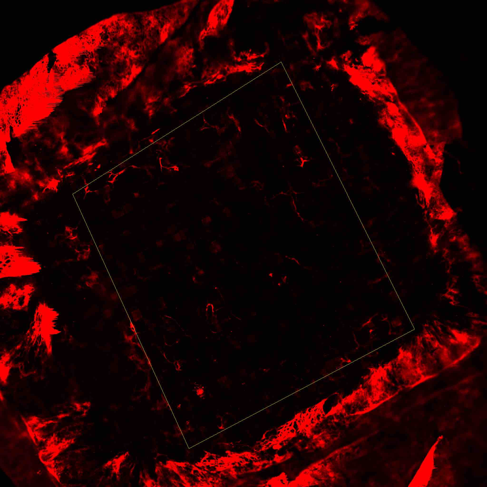

#Teaching R and Statistics Together

One of the challenges for teaching R is that students want to get started right away without thinking about what the output should look like and what their goal actually is with programming.  Encouraging students to stop and think will help them determine the best approach in R.


##The Grammar of Graphics for Data Visualization

A data visualization is a set of visual **geometries** whose **aesthetics** are mapped from data.

### Geometry 

- A geometry is a visual entity in space.    
- Some common geometries encountered in data visualizations:  
    - Point  
    - Line  
    - Bar  
    

### Aesthetics  

- An aesthetic is a visual attribute of a geometry  
- Common aesthetics:  
    - Position on horizontal (X)  
    - Position on vertical (Y)   
    - Shape  
    - Size  
    - Color  
        - Hue  
        - Saturation (“intensity”)  
        - Value (“brightness”)  
    - Text  


    
- Not all aesthetics are available for every geometry

### Data 

- To visualize, must have data in row-by-column format where:  
    - Rows represent cases: at most one geometry per case (assuming no aggregation)  
    - Columns represent variables: to be mapped to aesthetic attributes  

  

- Differences in geometry aesthetics map to differences in data variables  
- Available mappings depend on whether data variable is continuous (height) or discrete (race)  
- The following caveats apply:  
    - An aesthetic attribute can be mapped back to at most one variable  
    - A variable can be mapped to more than one aesthetic  
    - Not all mappings make sense 

> Students often do not recognize that a categorical variable is already summarized and confuse the count/frequency for a quantitative variable rather than a statistic.  


### Visualization using base R graphics
The base graphics often provide a very simple way for students to get plots quickly and explore data.  We will continue using the `cleanTeslaBattery` data.  Load it now and view it.

#### Histograms and boxplots
One wonderful thing about R is how intuitive the functions are, if you want a mean, the command is `mean`, if you want a boxplot, the command is 'boxplot'.
```{r include=FALSE}
cleanTeslaBattery <- read.csv("Data/cleanTeslaBattery.csv")
```

Run the command 'boxplot(cleanTeslaBattery$MaxRangeKM)'.  You should get the following:
```{r}
boxplot(cleanTeslaBattery$MaxRangeKM)
```
The x- and y-axis labels, main title, as well as color can be set using optional variables, xlab, ylab, main and color, respectively.  Modify your command to `boxplot(cleanTeslaBattery$MaxRangeKM, xlab = "All", ylab = "KM", main = "Max Range", col = "green")`.  R has many other colors built in and also accepts hexadecimals.  Search the web to find some other possible colors to modify your graph.

Replacing `boxplot()` with `hist` will give the expected effect.  Try it on one of the other quantitative variables.
```{r}

```

*  Note that histograms have an optional argument to control how many bins called breaks.  Try adding the option 'breaks = 50'
*  Set the number of breaks to 5, notice anything strange?
*  Set your histogram to another color


One other feature that is nice is that comparisons between quantitative variables can easily be done as well.  Suppose we want to compare the maximum range based on how frequently they supercharge their batteries.  Enter the command
```{r}
boxplot(MaxRangeKM ~ SuperchargeFreq, data = cleanTeslaBattery, las = 2)
```

*  Note the relational notation `y ~ x`
*  In many functions we can specify the data set to avoid extra typing
*  The `las` argument specifies turning the axis labels 90 degrees
*  The optional axis labels are as before
*  Colors can still be specified, but now we need a list of colors, one for each box.  Add the optional argument `col = heat.colors(8)`.  Note you must specify one for each category.  There are many color palettes.  You can view some with the command `?colors`. 


>**Teaching tip** One of the most common problems students run into here is not putting the variables in the correct order in the 'y ~ x'

### Scatterplots
Scatterplots follow a very similar syntax as doing side-by-side boxplots, but using the  `plot` function and replacing the qualitative explanatory variable with a quantitative one.  Let's explore the effect of Mileage (`MileageKM`) and the Maximum Range (`MaxRangeKM`).

```{r}
plot(MaxRangeKM ~ MileageKM, data = cleanTeslaBattery, col = "darkblue")
```

Note that the type of point can be controlled using the optional `pch = 2` command and changing the number for different point types. Color and labels are done as before.  Try adjusting your colors and labeling your plot.

Another nice alternative for large data sets is the `smoothScatter`, however it doesn't support the specification of data and will require explicitly referring to the x and y using the data frame name and '$' symbol.  Try it if you are interested.

Clearly this graph shows multiple trends due to the different battery sizes, so we would want to separate these out separately for regression or use a more advanced regression model.  For simplicity we are going to add a regression line without accounting for the car model.

Regression lines are implemented using the following process:

1.  Fit and save the model to the data using `lm()` (x and y are specified as in the plot).  This model is used for all other steps.
2.  Add the line to the scatterplot that has already been created using `abline()` applied to the model you have saved.  Colors for the line can be specified as before.
3.  Summarize the model using `summary()`.

Try it.

```{r}
plot(MaxRangeKM ~ MileageKM, data = cleanTeslaBattery, col = "darkblue")
line = lm(MaxRangeKM ~ MileageKM, data = cleanTeslaBattery)
abline(line, col = "red")
summary(line)

```


> **Teaching tip** Students frequently forget to create the plot first. The entire R chunk must be run in RMarkdown to preview the image.  
    
The correlation can be computed using the `cor` function.  Look up how to use it using `?cor` and try it.

### Bar graphs
Categorical data isn't much harder, but does require a preprocessing step for base graphics.  Let's create a boxplot of the Supercharging Frequency.  We will go straight to grouped bar plots.  Let's summarize the relationship between supercharging frequency and the location.  This is done in three steps:  

1. tabulate (using `table`, stored as `tble`)
2. compute conditional percentages (`prop.table`, stored as `ptable`)
2. plot (`barplot`)

Try it:
```{r}
tble = table(cleanTeslaBattery$SuperchargeFreq, cleanTeslaBattery$Location)
ptable = prop.table(tble,2)
barplot(ptable, beside = TRUE)
```
Note the organization of the table and the relationship between the rows and columns.

We can also add a legend and a location with the options
`legend.text = TRUE` and `args.legend = list(x = "topright")`.

Try adding them to your plot.


Note, there are many options for the placement of the legend other than “topright” that you may want to use if the legend overlaps your bars. These include “bottomright”, “bottom”, “bottomleft”, “left”, “topleft”, “top”, “topright”, “right”, and “center.”

Set the main title and colors (the number of colors should be the same as the number of rows in the table).  A quick way to get the number of colors is to count the number of levels of a factor.  You can replace the count with `length(levels(vblname))`, and substitute your `vblname`.    


A bar plot for a single variable can be accomplished by only passing in one variable.  Try it on one of the other categorical variables.

## What is a package?
Packages are collections of R functions, data, and compiled code in a well-defined format. The directory where packages are stored is called the library. R comes with a standard set of packages, called the base package. Others are available for download and installation. 


Packages that are curated, maintained, and reviewed are stored on the CRAN (Comprehensive R Archive Network).


Once installed, packages have to be loaded into the session to use the functions stored within the package. 


If you ever need R to do something that is not obvious, there is probably a package for that.  Many packages also provide vignettes or publish background and examples in the [Journal of Statistical Software](https://www.jstatsoft.org/index).

One of the more popular packages of packages is the `tidyverse`, which includes packages such as `dplyr`, `ggplot2`, and `readr` which make using R for data cleaning, graphics, and data science.  We will explore a few of these packages today, starting with `ggplot2` and the grammar of graphics.

## Package ggplot2

The package `ggplot2` stands for grammar of graphic plots.  It works to layer details onto a graphic map data to specific aesthetics using specific geometries.  If you have not already done so, install the `ggplot2` package.

```{r, eval=FALSE}
install.packages("ggplot2")
```

Open up the the R Notebook for [Data Visualization](Practice Notebooks/DataVizPractice.Rmd) and follow along.

Now load the package into R using either `library()` or `require()`
```{r}
library(ggplot2)
```

Let's make a graphic for the Tesla data:
```{r}
tesla<-read.csv("Data/cleanTeslaBattery.csv")
```

**Your Turn 1** Talk in a group - what relationship do you expect to see in the `tesla` data between the age of the battery (`Battery AgeDays`) and the amount of mileage put on the car since the battery was installed (`MileageSinceNewKM`)?  (No peeking!)

Run the following code in your notebook to make a graph, paying strict attention to spelling, capitalization, and parentheses.

```{r}
ggplot(data=tesla) + 
  geom_point(mapping=aes(x=BatteryAgeDays, y=MileageSinceNewKM))
```

Notice a few key things.  

1. `ggplot(data)` initializes the plot  
2.  adding a `+` after a line of ggplot code adds a new layer  
3.  start with the geometry  
4.  then specify the aesthetics  

Here is a similar graphic code with annotation.


Therefore, you can use this code template to make thousands of graphs with **ggplot2**.

```{r eval = FALSE}
ggplot(data = <DATA>) +
  <GEOM_FUNCTION>(mapping = aes(<MAPPINGS>))
```

Let's add on some more layers! What if we want to make the variable Replacement Battery to a color aesthetic?

```{r}
ggplot(data=tesla) + 
  geom_point(mapping=aes(x=BatteryAgeDays, y=MileageSinceNewKM, color=ReplacementBatt))
```

If we didn't care about mapping the new variable to an aesthetic, but wanted to change the color, that would come outside of the `aes()` function.  
```{r}
ggplot(data=tesla) + 
  geom_point(mapping=aes(x=BatteryAgeDays, y=MileageSinceNewKM), color="blue")
```


There are a lot of resources available, including a the ["ggplot2 Cheatsheet"](Documents/ggplot2 Cheatsheet.pdf)

**Your Turn 2**  Make the following density plot, using the Cheatsheet to help you.  What does the plot tell you about the Tesla driver habits in different regions?

```{r echo=FALSE}
ggplot(tesla) + 
  geom_density(aes(x=MileagePerDay,fill=Location)) + 
  xlab("Mileage Per Day") + 
  ylab("Density of Tesla Owners (all models)")
```


### Layering Graphics

To get a better idea about how `ggplot2` layers aesthetics and and specific geometries onto a graphic, check out [the ggplot flipbook](https://evamaerey.github.io/ggplot_flipbook/ggplot_flipbook_xaringan.html#1) which demonstrates how each layer modifies the graphic.


### Additional Resources

There are a lot of resources for `ggplot2`, here are three good places to start:

1. The [data visualisation](http://r4ds.had.co.nz/data-visualisation.html) and [graphics for communication](http://r4ds.had.co.nz/graphics-for-communication.html) chapters in R for data science. R for data science is designed to give you a comprehensive introduction to the `tidyverse`, and these two chapters will you get up to speed with the essentials of `ggplot2` as quickly as possible.  

2. If you’d like to take an online course, try [Data Visualization in R With ggplot2](http://shop.oreilly.com/product/0636920052807.do) by Kara Woo.  

3.  If you want to dive into making common graphics as quickly as possible, I recommend [The R Graphics Cookbook](http://amzn.to/2dVfMfn) by Winston Chang. It provides a set of recipes to solve common graphics problems. 

If you’ve mastered the basics and want to learn more, read [ggplot2: Elegant Graphics for Data Analysis](http://amzn.to/2fncG50). It describes the theoretical underpinnings of `ggplot2` and shows you how all the pieces fit together. This book helps you understand the theory that underpins `ggplot2`, and will help you create new types of graphics specifically tailored to your needs. The book is not available for free, but you can find the complete source for the book at [https://github.com/hadley/ggplot2-book](https://github.com/hadley/ggplot2-book).


## Statistical Inference

In this section we will cover some of the basic tools for statistical inference covered in an introductory statistics class.

A notebook to work along is found [here](PracticeNotebooks/InferenceNotebook.RMD)

### Linear Regression

Let's go back to the Tesla Battery Data from earlier.  We did linear regression when we added the regression line earlier, but now we will explore some of the other available tools with regression.

```{r}
cleanTeslaBattery = read.csv("Data/cleanTeslaBattery.csv")
```
Here is a look at a scatterplot of the data
```{r}
library(ggplot2)
ggplot(data=cleanTeslaBattery) + geom_point(aes(x=MileageKM, y=WattHoursPerKM))
```

Implement the linear model from before to look at the relationship between the Mileage (`MileageKM`) and Watt Hours Per KM (`WattHoursPerKM`) and assign the model to the variable `mod`

```{r}
mod = lm(WattHoursPerKM ~ MileageKM, data = cleanTeslaBattery)
summary(mod)

```

We can also easily inspect the residuals by calling the `residual()` function on the model.  Try it:
```{r}
hist(residuals(mod))
```

Additionally transforms of any of the variables can be performed in the following way:


```{r}
lm(WattHoursPerKM ~ log(MileageKM), data = cleanTeslaBattery)
lm(sqrt(WattHoursPerKM) ~ MileageKM, data = cleanTeslaBattery)
```

Finally, we left out the correlation coefficient.  The call for the correlation coefficient is a little different as it doesn't use relations `cor(x,y, use = "pairwise.complete.obs", method = "pearson")`.  Try the command here for the Mileage and Watt Hours Per KM.

```{r}


```

Note that the `use` option has been specified to omit pairs of correlations where there is an NA, and the `method` controls the type of correlation.

### t-tests
Here is a very quick overview of t-tests.  We are going to take a look at the difference in weight gain be smoking and non-smoking mothers in Kings County.  Load the dataset
```{r }
Kings <- read.csv("Data/KingCounty2001.csv") 
```
Take a look at the relationship between `smoker` and `wgain`.
```{r}
boxplot(wgain ~ smoker, data = Kings )
summary(Kings$smoker)
```

two-sample *t*-test syntax follows a simple format ```t.test(relationship, data, type of alternative)```  specify the type of alternative, either "greater", "less" or "two.tailed", using the `alternative` option.

```{r}
t.test(wgain ~ smoker, data = Kings, alternative = "greater")
```
Note that confidence intervals are included, but the alternative should be "two.sided."


One-sided *t*-tests require specifying only a single quantitative variable and also specifying the value from the null hypothesis.  An example for testing that the mean `wgain` is different from 9.4 is

```{r}
t.test(Kings$wgain, mu = 9.4, alt = "two.sided")
```

Other options like the `conf.level` are described under the help for the function.

Try computing a 90% confidence interval for the mean `gest`.

```{r}

```

###  Using simulation to teach reinforce concepts

The R community has many powerful interactive tools written in R to help teach R.

We are going to look at one of the tools offered at [www.artofstat.com](http://www.artofstat.com/webapps.html)

Here is an example of how we might use one of these to help students learn the Central Limit Theorem.  These are the instructions I would give students in class:

1. Go to the page [Sampling Distribution Simulator (Art of Stats)](https://istats.shinyapps.io/sampdist_cont/)
2. Select on of the real population datasets.  Sketch the population distribution you are shown. What are the mean and standard deviation (label appropriately)?
3.  Adjust the sample size to 5 and draw 1,000 samples.  Sketch the sampling distribution.  Repeat this 5 times (reset in between) sketching the sampling distribution.  Record the mean and standard deviation of the sampling distribution each time.  What do you observe about the sampling distribution?
4. Adjust the sample size to 10 and draw 1,000 samples.  Sketch the sampling distribution.  Repeat this 5 times (reset in between) sketching the sampling distribution.  Record the mean and standard deviation of the sampling distribution each time.  What do you observe about the sampling distribution?
5. Adjust the sample size to 20 and draw 1,000 samples.  Sketch the sampling distribution.  Repeat this 5 times (reset in between) sketching the sampling distribution.  Record the mean and standard deviation of the sampling distribution each time.  What do you observe about the sampling distribution?
6. Adjust the sample size to 20 and draw 1,000 samples.  Sketch the sampling distribution.  Repeat this 5 times (reset in between) sketching the sampling distribution.  Record the mean and standard deviation of the sampling distribution each time.  What do you observe about the sampling distribution?
7. Adjust the sample size to 100 and draw 1,000 samples.  Sketch the sampling distribution.  Repeat this 5 times (reset in between) sketching the sampling distribution.  Record the mean and standard deviation of the sampling distribution each time.  What do you observe about the sampling distribution?
8.  As you increase the sample size, what do you observe about the shape of the sampling distribution?
Etc.

Here is a link to the [full activity](Documents/SamplingDistributionActivity.pdf)

### Tools for resampling

We won't cover this in great depth here, but we will briefly explore what can be done here:
[Bootstrapping app](https://istats.shinyapps.io/Boot1samp/)


### Other tools commonly found in introductory statistics courses

#### ANOVA
We demonstrated *t*-tests earler, and the syntax for ANOVA is quite similar. 


**Teaching tip**  When teaching non-majors incorporating data from the research of faculty teaching courses from other disciplines can increase student engagement and course relevance.
    


For this section we are going to work with a dataset from a cancer drug development project that is part of a biology faculty member's ongoing research at our campus, the data came from one of the student projects.  Below is an image of one of the tumors.



The measurements in the file are the percent of tumor growth under various drug treatments. [Tumor.csv](Data/Tumor.csv).  Load the data now and inspect the dataset.

Construct a graphical summary of your data using one of the tools from earlier.

```{r}

```

We will also construct a numerical summaries of each group using the 
 `doBy` package.  Install and load it now.
 
```{r include=FALSE}
library(doBy)
Tumor <- read.csv("Data/Tumor.csv") 
```

For this I define a helper function:
```{r}
msd = function (x) {c(m = mean(x), stdev = sd(x))}
```

We apply this function using `summaryBy`.

```{r include=FALSE}
summaryBy(Growth ~ Treatment, data = Tumor, FUN = msd )
library(ggplot2)
ggplot(data = Tumor, aes(x=Treatment, y = Growth, fill = Treatment)) + geom_boxplot()
```
To run an ANOVA use the command `aov()` by specifying the relationship and the `data`, as you did for summarizing the data. 

```{r}
mod = aov(Growth ~ Treatment, data = Tumor)
```
Note that there is something missing that most intro stats students are asked for, what is it?

This can be fixed by wrapping the `aov` command with a `summary()`.  Try it.

Post-hoc tests can be run by saving the ANOVA model to a variable and then passing it to `TukeyHSD()`.

Try it here:

```{r}
TukeyHSD(mod)
```
There are other functions for the other types of post-hoc tests.

### Paired t-test
Paired t-tests require data in the wide format, that is two columns side by side, perhaps like this
```{r}
pairdat = data.frame(pre=c(23,20,30,29),post=c(25,21,27,31))
pairdat
```
Note this is for example only, not for validity.
```{r}
t.test(pairdat$pre, pairdat$post, paired=TRUE)
```


#### Testing for Proportions


For simplicity we are going to continue with the `cleanTeslaBattery`.  Suppose we want to look at the relationship between `Country` and `Model.`  

Create a two-way table and a bar plot for these variables.
```{r}
cleanTeslaBattery = read.csv("Data/cleanTeslaBattery.csv")
tbl = table(cleanTeslaBattery$Location,cleanTeslaBattery$Model)
tbl

```

```{r}

```

Chi-square is as simple as running `chisq.test()` on the two-way table.
```{r}
chisq.test(tbl)
```

Tests for proportions require the `prop.test` command and require just inputting the desired counts and/or population proportions.  We won't do an application here, but if 23 of 120 have a trait and we would like to see if the proprtion is significantly greater than 0.15, we might use the command
```{r}
prop.test(23,120, p=0.15, alternative = "greater")
```

As with the t-tests, notice that the confidence interval is an added bonus, but requires the two-sided option.

A two-sample test for proportions may be run similarly with a slight modification:
```{r}
prop.test(c(31,40),c(60,85), alternative = "greater")
```

where the first list specifies the counts with the trait in each of the two groups and the second list consists of the sample sizes for each of the two groups.


