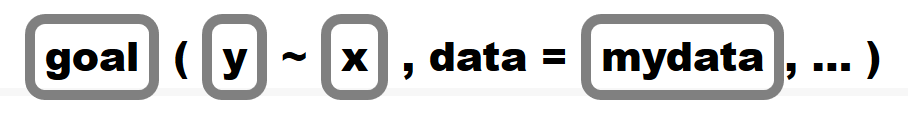

#R across the curriculum
##Pedagogy for Programming


### Why is R so scary?
For students and first time users, R can be scary because it is different from most of the technology we engage with daily.  Our smartphones and operating systems are structured to make us passive users of technology - the programs makes many of the decisions for us.  In contrast, R can only do what it is told and the instructions provided must be exact (including punctuation, capitalization, and grammar). The challenges of learning programming often lead students to think they are simply not programmers.  Just as we have to quash the "I'm not a math person" myth, we must also quash the "I'm not a programmer" myth.  

Here is some encouragement from the creator of RStudio and the tidyverse himself:  

> It's easy when you start out programming to get really frustrated and think, "oh it's me, I'm really stupid," or, "I'm not made out to program." But, that is absolutely not the case.  Everyone gets frustrated.  I still get frustrated occasionally when writing R code. It's just a natural part of programming. So, it happens to everyone and gets less and less over time. Don't blame yourself. Just take a break, do something fun, and then come back and try again. ~Hadley Wickham  

Also, here is a [great video of Hadley Wickham on Twitter](https://twitter.com/i/status/1022057084802748416) discussing the initial stages of learning R programming. 

Students will need encouragement (just as you will) to persevere.  Once the power of R is realized, especially for reproducibility, students tend to want to learn more!


### Getting Started with R in the Classroom

As instructors, we must always be aware of the cognitive load of our students. To learn both R and Statistics at the same time can be a challenge for students.  

](CognitiveLoad.png)

Students often assume they will have total recall once they see something, but they will lose information without rehearsal and retrieval.  Patience is key to learning R and unfortunately, to learn patience in programming usually means experience some form of trial first.


#### The First Week

To get students to learn R, they must use it regularly both in and out of the classroom.  So start using R the very first day (or at least week) of classes.  The time taken from class to make sure students have started on the right track with R is worth it in the long run.  Remember statistical computing is still an important part of statistics education so it deserves time within the classroom.

Here are some tips for getting started with R in the classroom:

- Don't be afraid of live coding, even if you make a mistake you can demonstrate how you solve the error or issue by modeling your cognitive process out loud.

- Be sure to model and talk your cognitive process as you code for students and don't skip steps.  

- Consider using post-its or other signals for students to get help or indicate they have successfully completed a task.  

- Take time to discuss output, even the output you won't use, as it is not always intuitive.  

- Avoid the black box and show in class how R produces output that matches with the computations/methods they have seen in class (and how it differs).  

- Create or use existing Videos/Demos/Tutorials online as resources for the students.  

- Make students think before they program. For example, have them consider the final graph they wish to create before they code or consider what the output should look like before they try to run any code.  


#### Paired Programming

In class, access to technology can be limited and students often need to share computers.  There is strong evidence that students should participate in paired programming regardless  (see [Pair Programming for Data Science and Statistics](https://teachdatascience.com/pairprogramming/)). The biggest challenge with students working in pairs or groups is that often they default to the "strongest" programmer in the group who takes over and does not support the learning of the other group members.  Therefore, we need to provide participation structures to be sure all students can learn to program together.  To support student learning, we've adapted a method called "Think Aloud Paired Problem Solving" from [Reading Apprenticeship](https://readingapprenticeship.org/) to be used in paired programming.  Students use the [R Task Card](Documents/R Activity Task Card.docx) as a guide and instructors assign roles and time limits to each role so that students rotate between being the listener and the problem solver.  The listener is the programmer and can only act at the instruction of the problem solver.  You can model this with your students, where you act as the listener and you can only act at the instruction of the students while you live code.  


#### Deciphering Errors  

Here is the notebook to follow along with [DecipheringErrorsPractice.Rmd](PracticeNotebooks/DecipheringErrors.Practice.Rmd)

One of the biggest challenges students experience in learning to use R are error messages.  They may experience error messages in several ways:  

1. Warnings when code still produces output  
2. Error messages when R code is not correct  
3. Error messages when RMarkdown documents cannot knit  

For warnings (#1) sometimes it is just letting the user know some function made decisions, such as dropping NA's or using an exact versus asymptotic method for a p-value calculations.  Other times, it can indicate a major issue with the code formulation, but that is usually when dealing with more advanced statistical methods.  

For error messages when RMarkdown documents cannot knit (#3) it may be due to R code, markdown, or YAML code issues.  The most common errors for students are  

1. They loaded the data or packages into the RStudio environment, but not within the RMarkdown environment.  So their code works, but once they try to knit the RMarkdown document the data/packages are not found because RMarkdown acts as its own environment (so that it is reproducible).  

2. R code errors within the RMarkdown document.  RMarkdown log files will indicate what line of the document the error occurred and will often provide some indication of why the error occurred.  Sometimes the document line number is not exact and the error is further down in the document, but at least it shows you where to start looking.    


For R code error messages, the most common mistakes are misspelling, punctutation (commas, parenthesis), and capitalization.  Let's see if we can decipher some errors in the following RMarkdown document so that we can knit it into a final document.  


### Additional Resources  

With the data science and technology boom there are has been more research and emphasis on evidence based practices in teaching programming and technology.  Here are a few that might be helpful.  

- [Teaching Tech Together (book)](http://teachtogether.tech/)  
- [Slides for RStudio Instructor Training](https://drive.google.com/open?id=1uvmJhR3Htqxen34jEsMzM_VPNk77W-lY)  
- [The Carpentries Instructor Training Modules](https://carpentries.github.io/instructor-training/)  
- [Teach Data Science Summer 2019 Blog](https://teachdatascience.com/)


## Examples, assignments, and projects

### First labs
General helpful principals:
* make sure they are successfull right away
* make it a useful tool so they want to use it
* reflect regularly
* timeliness and integration are key
* integrated into class activities or distinct labs
* demonstrate it for them (along with all of your errors, they need to see how to make mistakes and how you fix them)
* biggest hurdle is usually their fear as it isn't like anything they have done.

Here is an example of how I begin the first two days of an introductory statistics course (simple and quick to get results):

**Day 1**
[Intro Lab](Documents/IntroLabR.pdf)
And the corresponding data
[Fakedata.csv](Data/Fakedata.csv)

**Day 2**
[Lab 1](Documents/Lab1RGuidedPractice.pdf)

### In-class usage

Using R during class.

When first teaching the Central Limit Theorem I enter these while explaining what is happening
```{r eval=FALSE}
# skewed population
dataset <- 78-rexp(1000,1/2)

# skewed with not as sharp of a drop off
dataset = cbind(78-rexp(5000,1/5),78+rexp(200,1/1.1))

# bimodal population
dataset = c(rnorm(1000,80,20),rnorm(400,10,10))

mean(dataset)
median(dataset)
hist(dataset)#,xlim = c(70,80))

k <- 1000					# number of samples
n <- 50			# sample size
ran_samples <- matrix(sample(dataset, k*n, replace = TRUE), 
                      nrow = k, ncol = n)
head(ran_samples)
sample_means <-   apply( ran_samples, 1, mean)
head(sample_means)
hist(sample_means, xlim = c(20,100))
```

## R Packages for Teaching and Learning

### Base R vs. Packages for Learning  

There are a lot of options in base R, but often they can be clunky and a bit of a challenge for students.  Download the [Packages for Learning Notebook](PracticeNotebooks/JMMPractice-Packages_for_Learning.Rmd)

Let's look at an example (you can find the data called `KingCounty2011.csv` in [linked here](Data/KingCounty2001.csv): In 2001, a sample of 2500 births from King County, Washington contained information on both the mother and the infant at birth.
```{r}
king<-read.csv("Data/KingCounty2001.csv")
```

Suppose we want to compare the birth weight (`bwt`) of a baby between mothers who smoke (Y) versus do not smoke (N) (`smoker`).  

In base R, here is what the code would look like:

```{r}
mean(king$bwt[king$smoker=="Y"]) #smoke
mean(king$bwt[king$smoker=="N"]) #do not smoke
```

How would we calculate the standard deviation as well?

```{r}
sd(king$bwt[king$smoker=="Y"]) #smoke
sd(king$bwt[king$smoker=="N"]) #do not smoke
```

It quickly becomes cumbersome to do this for multiple summary statistics.  So what if there is a better way?  


### Package mosaic  

The `mosaic` package was developed by Randall Pruim, Danny Kaplan, and Nicholas Horton.  The goal of [Project mosiac](http://mosaic-web.org/) is to support the learning of R in colleges and universities.  Let's try our previous problem using functions in `mosaic`.  

First, install the package if you haven't done so already.  

```{r eval=FALSE}
install.packages("mosaic")
```  

Now, before we load the package, let's take a peak at the `mean()` function in base R.  What error results?

```{r eval=FALSE}
mean(king$bwt~king$smoker)
```

> `argument is not numeric or logical: returning NA[1] NA` 

What does that error message mean?


Now load the `mosaic` package and note the message provided when loaded:
```{r}
library(mosaic)
```

Notice that it states that   

> The following objects are masked from package:base:    
> max, mean, min, prod, range, sample, sum   

Package Mosaic overwrites several of the base package functions with new functions of the same name to make them adaptable to the formula notation. 



We can now run our `mean()` function (overwritten by `mosaic`)
```{r}
mean(bwt~smoker, data=king)
```

Many of the summary statistic functions of base R will now work in function form.  `mosaic` also adds new functions, such as `favstats` 

```{r}
favstats(bwt~smoker, data=king)
```

In addition, it allows for some simple graphics that allow faceting:  

```{r}
histogram(~bwt|smoker, data=king)
```

and easy bar graphs without the need to create a count table:
```{r}
bargraph(~smoker, data=king)
```

and overlay summary values: 
```{r}
histogram(~bwt, v=2500, data = king)
```


### Package ggformula  
Just like `mosaic`, `ggformula` was written to get students doing powerful visualization quickly, without having to learn the ins and outs of `ggplot2` or even base R. While `mosaic` has some graphing functionality, `ggformula` serves as an overlay for `ggplot2`, allowing the user to create quality graphics and to support multivariate reasoning via formulas.  To learn more, check out the vignette from the [ggformula package](https://cran.r-project.org/web/packages/ggformula/vignettes/ggformula-blog.html).  
Install the package and load it into R.
```{r}
#install.packages("ggformula")
library(ggformula)
```

You can easily "pipe" using the ` %>% ` symbol to overlay two graphs and you can use many of the `ggplot2` arguments within the `ggformula` functions.  For example:
```{r}
gf_boxplot(bwt~smoker, data=king) %>% 
  gf_violin(bwt~smoker, data=king, fill=~smoker, alpha=0.3)
```

Try out a few other plots using the King County birth weight data and `ggformula`.  

To learn more about the pipe `%>%` in R, read the [Pipes](https://r4ds.had.co.nz/pipes.html) chapter in R for Data Science.  


### Package infer
The objective of the `infer` package is to perform statistical inference using an expressive statistical grammar that mimics the `tidyverse` design framework.  The goal is to have students run a hypothesis test by using functions that follow these steps:


Install the package if you haven't done so already.  

```{r eval=FALSE}
install.packages("infer")
```  

and load the `infer` package:
```{r}
library(infer)
```


Let's look at an example, to compare the mean birth weights for infants born to smokers and non-smokers.

First, let's calculate the test statistic, what would we want to compare?
```{r}
king %>% 
  specify(bwt ~ smoker) %>%
  calculate(stat = "diff in means", order = c("Y", "N")) -> d_hat
```

Next we generate data under the null hypothesis and calculate the test statistic under the null hypothesis to determine the "null distribution" of the null hypothesis.  What is our null hypothesis?

$H_0: \mu_{smoker} = \mu_{nonsmoker}$  
$H_0: \mu_{smoker} \neq \mu_{nonsmoker}$  

```{r}
king %>%
  specify(bwt ~ smoker) %>%
  hypothesize(null = "independence") %>%
  generate(reps = 1000, type = "permute") %>%
  calculate(stat = "diff in means", order = c("Y", "N")) -> null_dist
```


Finally, we can visualize the null distribution and p-value.  What conclusion should we draw from our inference?
```{r}
visualise(null_dist) + 
  shade_p_value(obs_stat = d_hat, direction = "two_sided")
```

You can learn more about the infer package for different tests by reading the [`infer` vignettes](https://cran.r-project.org/web/packages/infer/index.html).


### Packages for Learning R - Swirl

`swirl` is a package designed to let you learn R within R.  Check out the [Swirl webpage](https://swirlstats.com/) to learn more.  To get started, you just have to load the library (after you install it of course).

```{r eval=FALSE}
install.packages("swirl")
library(swirl)
```


