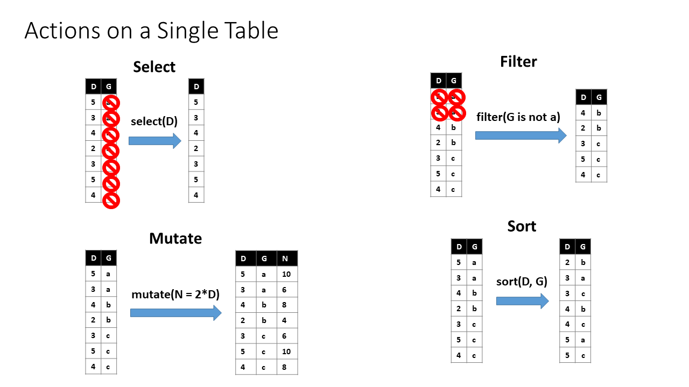
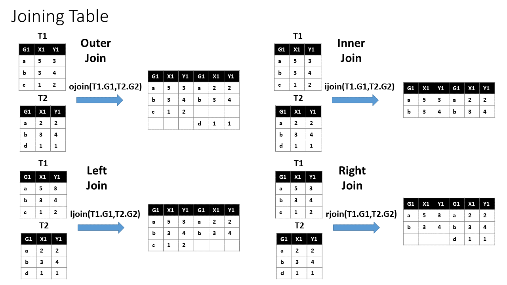
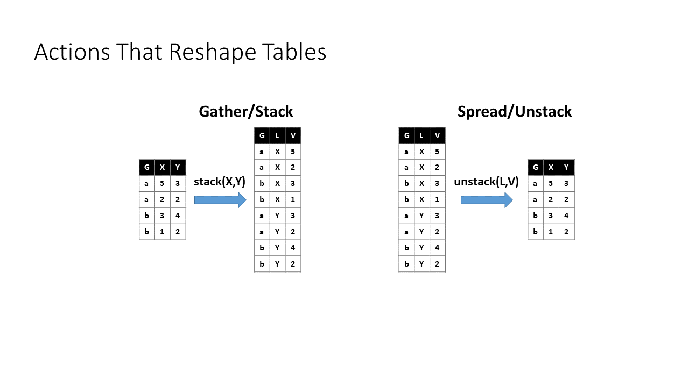

# Untidy Data

## Tidy Data

> “Happy families are all alike; every unhappy family is unhappy in its own way.” –– Leo Tolstoy

> “Tidy datasets are all alike, but every messy dataset is messy in its own way.” –– Hadley Wickham

R works best with "tidy data".  There are three interrelated rules which make a dataset tidy:

1. Each variable must have its own column.  
2. Each observation must have its own row.  
3. Each value must have its own cell.  

[R for Data Science](Images/tidy/tidy-1.png)  


Most data does not start out "tidy".  Fortunately, the `tidyverse` was designed to help with the process of turning messy data into tidy data.  Packages such as `dplyr`, `tidyr`, `lubridate`, `forcats`, and `stringr` allow the user to clean up data and eventually turn it into nice and tidy data.  

It would be impossible to teach you how to clean data in all circumstances in the 15 minutes we have, but I wanted to overview the grammar of data cleaning for you.  The functions in `tidyr` and `dplyr` mimic the grammar of data cleaning to make it easy to learn.  

- Select - choose specific columns  
- Filter - choose specific rows  
- Sort/Arrange - order the rows in the columns  
- Mutate - add a new column    




- Join - join two data tables together  



- Gather - gather column names that are values instead of variables into a single column  
- Spread - spread out observation values to new column variables with they are spread across multiple rows  



The best way to learn to clean data is to clean data!  I highly recommend working through [R for Data Science](https://r4ds.had.co.nz/) and the exercises included ([here are the solutions](https://r4ds.had.co.nz/)).  

In addition to navigating the shape of the data, there are often fun surprises within the data even with technically "tidy".  You might have character strings that are messy and contain information that needs to be extracted (use `stringr`), or dates (use `lubridate`), or that need to be specified as ordered factors (use `forcats`).  `base` R will often make decisions for you when reading in data as well.  To avoid that, use `readr` to specify variable/data types when reading in the data to save a headache later!


### Example - Cleaning the Tesla Data
The Tesla data was actually "tidy" in format, but had a lot of dates (in multiple formats) and strings that needed some massaging.  Here is what I did (more could be done!) to get the data ready for your use.  Here is the [original data](Data/TeslaBatterySurvey2018.csv)

```{r}
library(readr)
library(dplyr)
library(stringr)
library(lubridate)
tesla<-read_csv("Data/TeslaBatterySurvey2018.csv")
```


```{r eval=FALSE}
tesla %>%
  rename(BatteryAgeDays=`Battery AgeDays`) %>% 
  mutate(DailyChargeLevel=as.numeric(str_sub(DailyChargeLevel,1,2))) %>% 
  mutate(Location=str_replace_all(tesla$Location,"uK", "UK")) %>% 
  mutate(ReadDate=parse_date_time(ReadDate, c("%d-%b-%y", "%m/%d/%Y", "%d. %b %Y"),exact=TRUE)) %>% 
  mutate(ManufactureDate=parse_date_time(ManufactureDate, 
                                         c("%d-%b-%y", "%m/%d/%Y", "%d. %b %Y"),exact=TRUE)) %>% 
  mutate(ModelXS=str_split(Model," ", simplify = TRUE)[,2], 
         ModNum=str_split(Model," ",simplify = TRUE)[,3]) %>% 
  write_csv("cleanTeslaBattery.csv")
```


```{r}
newtesla<-read.csv("cleanTeslaBattery.csv")
str(newtesla)
```

## Miscellany on data types in R

R has several built-in data types that you may find useful:

*Vector*, like arrays in other languages, a collection of entries, each with the same type of data.
```{r}
1:4
```


*Lists* with mixed data types
```{r}
list("28",14)
```


*Matrices* for storing data of all the same type:
```{r}
 A = matrix( 
   c(1, 3, 5, 9, 2, 1), # the data elements 
   nrow=2,              # number of rows 
   ncol=3,              # number of columns 
   byrow = TRUE)        # specify to fill in across the rows or down the columns

```
Note that we have been using data frames that can be built from the ground up.
```{r}
weight = c(55,33,21,19)
height = c(67,41,35,24)
pet = c("cat","dog","cat","lizard")
dat = data.frame(height,weight, pet)
summary(dat)
```


Note that entries in data frames can be accessed much as the way they are in other languages.  Try each of the following.  What do each of them do?

    dat[1,2]
    dat[,2]
    dat[2:3,]
    dat[c(1,4),]
    dat[,"weight"]
    dat[,c("height","pet")]
    dat[-2,]

One of the other incredibly handy features is that rows can also be selected based on various criteria.  We can select the rows where the pet is a cat using the command or the weight of the rows where the pet is a cat using the following two commands:

```{r}
dat[dat$pet=="cat",]
dat[dat$pet=="cat","weight"]
```

  
 R also casts vectors to apply arithmetic operations to lists and also allows dynamic variable assignment in data frames.  Below we will rescale the weight by multiplying by 16 and save it in the column new height
```{r}
dat$newheight = dat$height *16
dat
```
 
This can be handy for normalizing and transforming data.  Note there is also a *scale* function for rescaling data.


